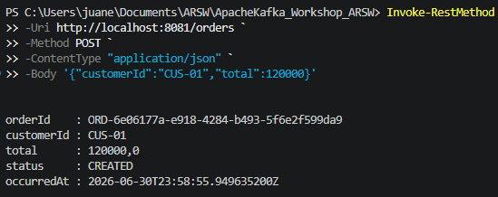
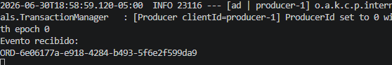

# ApacheKafka Workshop ARSW  - Juan Esteban Rodríguez

## 1. Evolution towards event-driven architectures

| Process             | Communication Type | Justification |
|---------------------|--------------------|---------------|
| Browse Products     | Synchronous        | Customers expect an immediate response to view product information, prices, and availability in real time.             |
| Create Order        | Hybrid             | The order request should be processed synchronously to confirm that it was received successfully, while follow-up tasks can be handled asynchronously through events.        |
| Validate Payment    | Synchronous                   | Payment validation requires an immediate response to determine whether the transaction is approved or rejected before continuing the purchase process.        |
| Send Notification   | Asynchronous                 |Email or SMS notifications do not need to delay the user's request. They can be sent after the main transaction has completed.         |
| Update Analytics    | Asynchronous                 | Analytics processing is not critical to the user's experience and can be performed in the background using published events.        |
| Register audit logs | Asynchronous                 |  Audit records can be stored after the transaction by consuming events, improving scalability without affecting response time.       |

## 2. Apache Kafka

### Current Configuration:
- Topic: order
- Partitions: 1
- Replication Factor: 1
- Message Key: None
- Retention: 24 hours

### Risks

| Configuration          | Risk                                                                                                       |
|------------------------|------------------------------------------------------------------------------------------------------------|
| 1 Partition            | All events are processed by a single consumer, limiting scalability and creating a performance bottleneck. |
| Replication Factor = 1 | If the broker fails, the topic and its data become unavailable, resulting in possible data loss.           |
| No message key         | Related events may not be consistently assigned to the same partition in the future, making it difficult to preserve event ordering for the same order.                                                                                                          |
| 24 hour retention      | Events are deleted after one day, reducing the ability to replay events, recover from failures, perform audits, or support analytics.                                                                                                          |

### Improvements for Production

| Configuration      | Recommendation                    | Reason                                                                            |
|--------------------|-----------------------------------|-----------------------------------------------------------------------------------|
| Partitions         | Increase to 3 or more partitions. | Improves scalability and allows multiple consumers to process events in parallel. |
| Replication Factor | Use a replication factor of 3.    | Provides fault tolerance and high availability if a broker fails.                                                                                  |
| Message Key        | Use a orderId as partition key    | Ensures that all events related to the same order are stored in the same partition, preserving their order.                                                                                  |
| Retention          | Increase retention to several days or weeks, depending on business requirements.                                  | Enables event replay, auditing, troubleshooting, and analytics.                                                                                  |

## 3. First steps for lab

### Docker
We created the docker and compose it}

Then we create the topics, the messages and finally the consumers

Using http://localhost:8080 we open the interfaces to check the topics 

We check the messages for each topic in JSON format

## 4. Event Traceability

- The event starts with an HTTP **POST** request to `/orders`.

- `OrderController` creates an `OrderCreatedEvent` and sends it through `OrderEventProducer` to the Kafka topic **orders** using the **orderId** as the message key. 

- Kafka stores the event in a partition (automatically assigned, e.g., Partition 0). 

- `OrderEventConsumer`, which belongs to the **inventory-service** Consumer Group, listens to the `orders` topic and processes the event successfully.

- Evidences:

#  5. Event Flow Design

## Proposed Event Flow

| Producer | Event | Topic | Consumer | Consumer Group | Partition Key |
|----------|-------|-------|----------|----------------|---------------|
| Order Service | order-created | orders | Payment Service | payment-service | orderId |
| Order Service | order-created | orders | Inventory Service | inventory-service | orderId |
| Payment Service | payment-approved / payment-rejected | payments | Notification Service | notification-service | orderId |
| Inventory Service | inventory-reserved / inventory-rejected | inventory | Notification Service | notification-service | orderId |
| Payment Service | payment-approved | payments | Invoice Service | invoice-service | orderId |
| Order Service | order-created | orders | Analytics Service | analytics-service | orderId |
| Payment Service | payment-approved / payment-rejected | payments | Analytics Service | analytics-service | orderId |
| Inventory Service | inventory-reserved / inventory-rejected | inventory | Analytics Service | analytics-service | orderId |
| All Services | audit-record-created | audit | Audit Service | audit-service | correlationId |

## Justification

Using separate topics instead of a single global `events` topic provides several advantages:

- Events are organized by business domain, making them easier to manage and maintain.
- Each service subscribes only to the topics it needs, reducing unnecessary message processing.
- Topics can have independent retention policies, partitions, and security configurations.
- Consumer Groups can scale independently for each business capability.
- Partitioning by `orderId` preserves the ordering of events related to the same order.
- A single `events` topic would mix unrelated messages, increase network traffic, complicate filtering, and reduce scalability.

